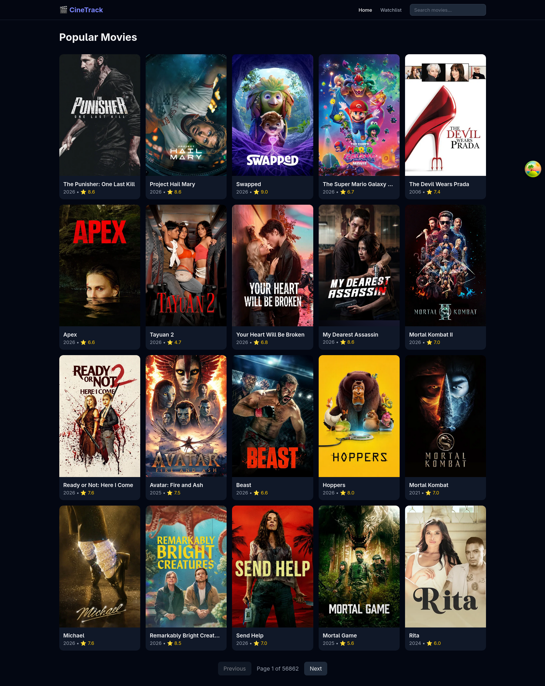

# CineTrack 🎬

A movie discovery and watchlist app built with React, TypeScript,
and the TMDB API.

🔗 **Live demo:** https://cinetrack-drab.vercel.app/



## Features

- **Browse popular movies** — paginated grid with TMDB data
- **Search** — instant results with loading and empty states
- **Movie detail** — backdrop hero, cast, budget, production info
- **Watchlist** — add/remove movies, sort by date/rating/title
- **Filter by rating** — range slider to filter watchlist
- **Prefetch on hover** — instant navigation to detail pages
- **Persistent watchlist** — survives page refresh via Zustand persist

## Tech Stack

- React 18 + TypeScript
- React Router v6 — client-side routing, lazy loading
- TanStack Query — server state, caching, prefetching
- Zustand — watchlist state with localStorage persistence
- Tailwind CSS — utility-first styling
- Axios — typed HTTP client
- TMDB API — movie data
- Vite — build tooling
- Vercel — deployment

## What I learned

A React project — first with TypeScript. Key concepts:
component architecture with strict typing, TanStack Query for
server state with prefetching, Zustand for persistent client state,
and React Router for SPA navigation with lazy loading.

## Run locally

```bash
git clone https://github.com/yourusername/cinetrack
cd cinetrack
npm install
# Add your TMDB Bearer token to .env.local
# VITE_TMDB_TOKEN=your_token_here
npm run dev
```
